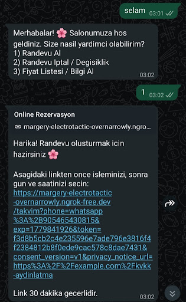
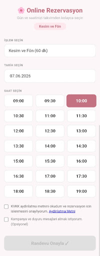
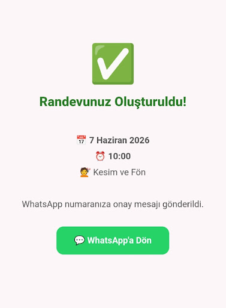
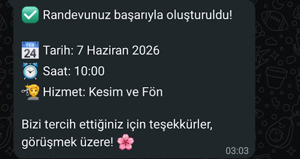

# Rezevy 💇‍♂️📅

Güzellik salonları, kuaförler ve berberler için geliştirilmiş; WhatsApp otomasyonu, dinamik Webview arayüzü ve Google Takvim senkronizasyonu ile randevu süreçlerini uçtan uca yöneten, yüksek performanslı asenkron backend API altyapısı.

🚧 **Durum:** Aktif Geliştirme Aşamasında (Work in Progress)

---

### ✨ Öne Çıkan Özellikler

* **WhatsApp & Webview Entegrasyonu:** Müşteri WhatsApp üzerinden randevu talep ettiğinde, sistem saniyeler içinde işletmenin canlı müsaitlik durumunu yansıtan tek kullanımlık, şifreli bir Webview linki üretir ve iletir.
* **Google Calendar Senkronizasyonu:** Çakışma (double-booking) kontrolleri arka planda yapılarak web arayüzünden tamamlanan randevular otomatik olarak işletmenin Google Takvimi'ne işlenir ve müşteriye WhatsApp üzerinden anlık onay mesajı gönderilir.
* **Akıllı Hatırlatma Motoru (Smart Reminder):** Randevu zamanına kalan süreye göre dinamik çalışan (24 saat kala veya 2 saat kala) otomatik hatırlatma mekanizması ile "Gelmeyen Müşteri" (No-show) oranını ve işletme ciro kaybını minimuma indirir.
* **HMAC-SHA256 Tabanlı Güvenlik (Zero Trust):** Müşterilere iletilen dinamik randevu linkleri HMAC-SHA256 algoritması ile şifrelenmiş olup, süreli (Time-to-Live) ve tek kullanımlık mimariye sahiptir; manipülasyonları engeller.
* **Dönüşüm Hunisi Analitiği (Funnel Tracking):** Müşterilerin sisteme hangi kanallardan ulaştığını (Instagram, Google vb. UTM parametreleri ile) ve randevu tamamlama adımlarının hangisinde (sayfa açılışı, hizmet seçimi, onay aşaması) takıldığını loglayan analitik altyapı.
* **Yerleşik KVKK Uyumluluğu:** Randevu alımı sırasında kullanıcıdan onay alan entegre KVKK aydınlatma ve veri işleme mekanizması.

---

### 🛠️ Teknik Altyapı ve Teknolojiler

* **Backend Framework:** Python / FastAPI (Tamamen asenkron, yüksek hızlı ve yüksek eşzamanlı işlemlere [concurrency] uygun mimari)
* **API & Entegrasyonlar:** Google Calendar API, Twilio API (WhatsApp Gateway & Webhooks)
* **Güvenlik & Kriptografi:** HMAC-SHA256 Token Doğrulama, Environment Tabanlı Gizlilik

---

### 📸 Ekran Görüntüleri

<p align="center">
  
  
</p>

<p align="center">
  
  
</p>

---

### 📂 Proje Yapısı (Folder Structure)


```text
Rezevy/
├── app/
│   ├── api/
│   │   ├── calendar_routes.py   # Webview arayüzü ve rezervasyon API endpoint'leri
│   │   └── webhook.py           # Twilio WhatsApp mesaj ve state yönlendirmeleri
│   ├── services/
│   │   ├── calendar_service.py  # Google Calendar API entegrasyonu
│   │   ├── llm_service.py       # Yapay zeka / mantık servisleri
│   │   └── session_service.py   # Kullanıcı session ve state yönetimi
│   └── main.py                  # FastAPI uygulama giriş noktası (Entrypoint)
├── logs/
│   └── funnel_events.jsonl      # Dönüşüm hunisi (Funnel) log kayıtları
├── .env.example                 # Çevresel değişkenlerin şablonu (Gizli veriler hariç)
├── .gitignore                   # Güvenlik için repoya dahil edilmeyen dosyalar
└── requirements.txt             # Proje bağımlılıkları
```
*(Not: Sunucuya ve lokale özel `__pycache__`, `.venv`, `ngrok.exe` ve `credentials.json` gibi dosyalar mimari gereği repoya dahil edilmemiştir.)*

---

### 🚀 Kurulum ve Çalıştırma (Local Setup)

Projeyi kendi bilgisayarınızda (local) çalıştırmak için aşağıdaki adımları izleyebilirsiniz.

### 1. Repoyu Klonlayın ve Sanal Ortam Oluşturun

```bash
git clone [https://github.com/mardakorkut/Rezevy.git](https://github.com/mardakorkut/Rezevy.git)
cd Rezevy
python -m venv venv314
```

**Windows için:**
```powershell
.\venv314\Scripts\activate
```

**MacOS/Linux için:**
```bash
source venv314/bin/activate
```

**2. Gerekli Kütüphaneleri Yükleyin:**
```bash
pip install -r requirements.txt
```

**3. Çevresel Değişkenleri (Environment Variables) Ayarlayın:**
Proje ana dizininde bulunan `.env.example` dosyasının adını `.env` olarak değiştirin ve içindeki API anahtarlarını kendi sisteminize göre doldurun:

```ini
# .env dosyası
# Uygulama ve Bölge Ayarları
APP_ENV=dev
TIMEZONE=Europe/Istanbul

# LLM Provider Seçimi: openai | gemini
LLM_PROVIDER=gemini

# OpenAI Ayarları (Kullanılacaksa)
OPENAI_API_KEY=your_openai_api_key_here
OPENAI_MODEL=gpt-4o-mini

# Gemini Ayarları (Kullanılacaksa)
GEMINI_API_KEY=your_gemini_api_key_here
GEMINI_MODEL=gemini-2.5-flash

# Google Calendar Entegrasyonu
GOOGLE_CALENDAR_ID=your_calendar_id_here@group.calendar.google.com
GOOGLE_CREDENTIALS_PATH=credentials.json

# Twilio (WhatsApp) Ayarları
TWILIO_ACCOUNT_SID=your_twilio_sid_here
TWILIO_AUTH_TOKEN=your_twilio_auth_token_here
TWILIO_WHATSAPP_NUMBER=whatsapp:+1234567890

# Güvenlik & Konfigürasyon (min 32 bytes = 64 hex chars)
BOOKING_LINK_SECRET=your_super_secret_hmac_key_here
# Opsiyonel: Ngrok veya prod URL'nizi buraya girebilirsiniz
# BOOKING_BASE_URL=https://your-ngrok-url.ngrok-free.app

# Smart Reminder Kuralı (smart | double | single24 | single2 | none)
REMINDER_MODE=smart

# KVKK & Dönüşüm Hunisi (Funnel)
KVKK_CONSENT_VERSION=v1
PRIVACY_NOTICE_URL=https://example.com/kvkk-aydinlatma
FUNNEL_LOG_ENABLED=true
```

**4. Uygulamayı ve Tüneli Başlatın:**
FastAPI sunucusunu başlatmak için Uvicorn kullanın:
```bash
python -m uvicorn app.main:app --reload
```
WhatsApp webhooks'un local sunucunuza erişebilmesi için Ngrok (veya benzeri) bir tünel açın:
```bash
ngrok http 8000
```
*Ngrok'tan aldığınız HTTPS linkini, Twilio panelindeki Sandbox Webhook URL kısmına (`/api/webhook` uç noktası ile) eklemeyi unutmayın.*

---

### 👨‍💻 Geliştirici

**Muhammed Arda Korkut**
Computer Engineering Student & Backend Developer
